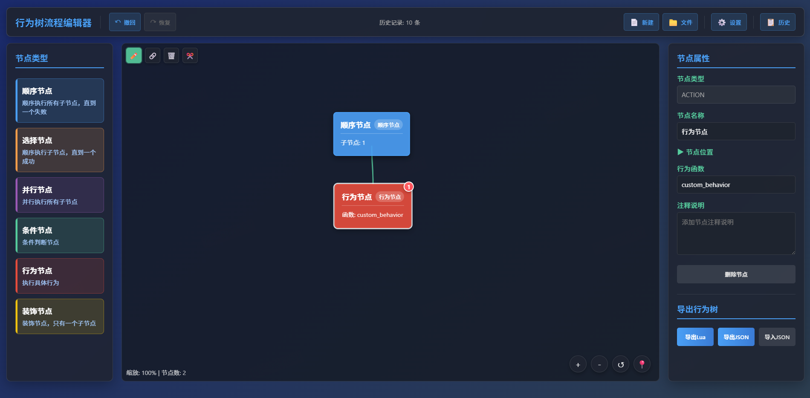

# 行为树编辑器
这是一个适用于蛋仔派对的行为树工具
你可以访问在线工具[行为树编辑器](http://www.eggycode.com/behavior)进行编辑

# 快速开始
## 导入模块
请将项目中的`behavior`目录以及`ClassUtils.lua`放置于你的蛋仔Lua工程主目录中

接着想要使用自定义行为树，你需要先在你的main文件中导入所需文件
```lua
--- main.lua
require "behavior.config"
```

## 编辑一个自定义行为树
### 新建
请务必先在右上角点一个`新建`，以此创建一个文件。

### 使用编辑工具
请放心，除非你手动清除缓存，否则你所做的一切操作都会缓存在本地，下次打开网页后将可以继续操作，你也可以通过文件管理功能以此制作多个行为树，在多个文件中快速切换是被网站支持的。

在网站[行为树编辑器](http://www.eggycode.com/behavior)中编辑行为树，当然你也可以直接使用项目中的[网站](./behavior_web/index.html)自行构建本地编辑器。

以下是一个示例


这份示例中我们期望按顺序执行一个行为节点，它的自定义行为是custom_behavior

### 自定义路径
如果我们要设置一个通用的自定义路径，可以在右上角设置中设置，例如


## 导出自定义行为树

在示例中，使用左下角`导出Lua`按钮我们将得到一个`behavior_tree_test.lua`

将该文件放置到蛋仔Lua工程文件主目录中。

## 创建我们的自定义行为

### 工程操作
在示例中，我们需要在蛋仔Lua工程文件中创建我们的自定义行为。

由于我们先前指定的[自定义路径](#自定义路径)是path，因此我们需要在主目录中创建path文件夹，接着我们需要在path文件夹中创建`custom_behavior.lua`的lua文件（这个文件名称必须是我们节点中所指定的函数名称）

### 开始创建行为
在刚刚新建的`custom_behavior.lua`文件中编写如下函数
```lua
--- custom_behavior.lua
---@param blackboard Blackboard 黑板数据
return function(blackboard)
    blackboard:set("test", "test_info")
    print(blackboard:get("test"))
    return BT.STATUS.RUNNING
end
```

## 实践
现在让我们在main函数中尝试使用该行为树

```lua
--- main.lua
require "behavior.config"

local tree = AIConfig.build_tree(require "behavior_tree_test") ---这个文件是我们先前导出的文件
tree:tick()
tree:tick()
```

运行后我们会成功输出
```
[0]: test_info
[1]: test_info
```

# 节点状态

在本项目中，我们使用BT.STATUS中的状态作为所有节点的状态

条件节点比较特殊，条件节点只允许返回true和false，它们分别相当于“成功状态”和“失败状态”


运行状态 BT.STATUS.RUNNING

成功状态 BT.STATUS.SUCCESS

失败状态 BT.STATUS.FAILURE


如果你的节点没有返回任何状态，会默认返回 BT.STATUS.FAILURE 状态

# 贡献

豆油汉堡